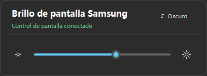

# Samsung Tizen Brightness

<p align="center"><a href="README.md">English</a> · <a href="README.zh-CN.md">简体中文</a> · <a href="README.ko.md">한국어</a> · <strong>Español</strong></p>

Una app para la bandeja de Windows que ajusta la retroiluminación de pantallas Samsung **directamente mediante IP Remote**. No necesita una app en el televisor, modo desarrollador, Tizen Studio ni certificados de desarrollo.

<p align="center"></p>

## Configuración

1. Descarga el **instalador Setup** o el EXE portátil desde [Releases](https://github.com/dttutty/samsung-tizen-brightness/releases/latest). El entorno .NET está incluido.
2. Conecta el PC y la pantalla a la misma LAN. En el televisor, abre **Ajustes → Todos los ajustes → Conexión (Connection) → Red → Configuración experta (Expert Settings) → IP Remote** y selecciona **Enable (Activar)**.
3. Inicia la app e introduce la IP de la pantalla. Haz clic derecho en el icono de la bandeja → **Autorizar IP Remote…** y selecciona **Allow (Permitir)** en el televisor una sola vez. Mantén el televisor encendido durante el emparejamiento.
4. Haz clic izquierdo en el icono para ajustar el brillo. Cambia el idioma desde el menú de clic derecho → **Idioma**.

En televisores antiguos, usa **Ajustes → General → Red → Configuración experta**. Si IP Remote no está disponible, revisa **Power On with Mobile** en el mismo menú; ese ajuste del televisor no habilita el control automático de energía en esta app. [Guía de Samsung](https://image-us.samsung.com/SamsungUS/samsungbusiness/tv-ci-resources/Samsung-IP-Control.pdf).

## Requisitos y comportamiento

- Windows 11 x64 y una pantalla Samsung compatible. No es necesario instalar .NET por separado. Probado en M7 / M70B (`LS43BM702UNXZA`); otros modelos requieren comprobación.
- Solo brillo: sin encendido/apagado automático, Wake-on-LAN, cuenta atrás ni control alternativo mediante el menú de imagen. No cambia el modo de espera nativo por falta de señal.
- El inicio opcional al entrar en Windows inicia solo la app de bandeja. Incluye el cambio de modo claro/oscuro de Windows.
- El permiso se guarda solo localmente, cifrado con Windows DPAPI y vinculado al certificado del televisor. Los clics normales no vuelven a solicitar permiso.

## Compilar

```powershell
dotnet publish .\src\SamsungTizenBrightness\SamsungTizenBrightness.csproj -c Release -r win-x64 --self-contained false
dotnet run --project .\tests\SamsungTizenBrightness.Tests -c Release
```

Proyecto comunitario no oficial, sin afiliación con Samsung. No incluye restablecimiento de fábrica ni operaciones del menú de servicio.

[MIT](LICENSE)
