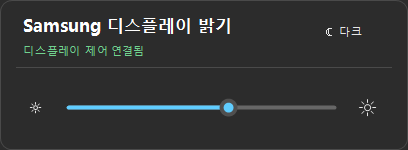

# Samsung Tizen Brightness

<p align="center"><a href="README.md">English</a> · <a href="README.zh-CN.md">简体中文</a> · <strong>한국어</strong> · <a href="README.es.md">Español</a></p>

Samsung 디스플레이의 하드웨어 백라이트를 **IP Remote로 직접 조절**하는 Windows 트레이 앱입니다. TV 앱, 개발자 모드, Tizen Studio 또는 개발자 인증서가 필요하지 않습니다.

<p align="center"></p>

## 설정

1. [최근 성공한 빌드](https://github.com/dttutty/samsung-tizen-brightness/actions/workflows/build.yml)의 **Artifacts**에서 **Samsung-Tizen-Brightness-win-x64**를 다운로드하세요. GitHub 로그인이 필요합니다.
2. PC와 디스플레이를 같은 LAN에 연결하세요. TV에서 **설정 → 전체 설정 → 연결(Connection) → 네트워크 → 전문가 설정(Expert Settings) → IP Remote**로 이동하고 **Enable(사용)**을 선택하세요.
3. 앱을 실행하고 디스플레이 IP를 입력하세요. 트레이 아이콘을 오른쪽 클릭 → **IP Remote 승인…**을 선택한 후 TV에서 한 번 **Allow(허용)**를 선택하세요. 페어링 중에는 TV를 켜 두세요.
4. 트레이 아이콘을 왼쪽 클릭하여 밝기를 조절하세요. 오른쪽 클릭 메뉴 → **언어**에서 앱 언어를 변경하세요.

구형 TV에서는 **설정 → 일반(General) → 네트워크 → 전문가 설정**을 사용하세요. IP Remote를 사용할 수 없으면 같은 메뉴의 **Power On with Mobile**을 확인하세요. 이 TV 설정을 켜도 앱이 자동으로 전원을 제어하지는 않습니다. [Samsung 설정 안내](https://image-us.samsung.com/SamsungUS/samsungbusiness/tv-ci-resources/Samsung-IP-Control.pdf).

## 요구 사항 및 동작

- Windows 11, .NET 10 Desktop Runtime 및 호환되는 Samsung 디스플레이가 필요합니다. M7 / M70B(`LS43BM702UNXZA`)에서 검증했으며 다른 모델은 확인이 필요합니다.
- 밝기만 조절합니다. 자동 전원 제어, Wake-on-LAN, 카운트다운 또는 TV 화면 메뉴를 이용한 대체 제어는 없습니다. TV의 신호 없음 대기 동작은 변경하지 않습니다.
- Windows 로그인 시 트레이 앱만 자동 실행하도록 설정할 수 있습니다. Windows 라이트/다크 모드 전환도 지원합니다.
- 권한은 Windows DPAPI로 암호화하고 TV 인증서에 연결하여 로컬에만 저장합니다. 일반 클릭은 권한을 다시 요청하지 않습니다.

## 빌드

```powershell
dotnet publish .\src\SamsungTizenBrightness\SamsungTizenBrightness.csproj -c Release -r win-x64 --self-contained false
dotnet run --project .\tests\SamsungTizenBrightness.Tests -c Release
```

Samsung과 무관한 비공식 커뮤니티 프로젝트입니다. 공장 초기화나 서비스 메뉴 작업은 포함하지 않습니다.

[MIT](LICENSE)
