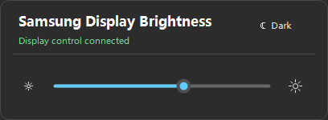

# Samsung Tizen Brightness

<p align="center"><strong>English</strong> · <a href="README.zh-CN.md">简体中文</a> · <a href="README.ko.md">한국어</a> · <a href="README.es.md">Español</a></p>

A Windows tray app that controls Samsung display hardware backlight **directly over IP Remote**. No TV app, Developer Mode, Tizen Studio or developer certificate is needed.

<p align="center"></p>

## Setup

1. Download the **Setup** installer or portable EXE from [Releases](https://github.com/dttutty/samsung-tizen-brightness/releases/latest). The .NET runtime is included.
2. Connect the PC and display to the same LAN. On the TV, open **Settings → All Settings → Connection → Network → Expert Settings → IP Remote**, then select **Enable**.
3. Start the app and enter the display IP. Right-click its tray icon → **Authorize IP Remote…**, then choose **Allow** on the TV once. Keep the TV on during pairing.
4. Left-click the tray icon to adjust brightness. Right-click → **Language** to change the app language.

Older TVs may use **Settings → General → Network → Expert Settings**. If IP Remote is unavailable, check **Power On with Mobile** in the same menu; this TV setting does not enable automatic power control in this app. [Samsung guide](https://image-us.samsung.com/SamsungUS/samsungbusiness/tv-ci-resources/Samsung-IP-Control.pdf).

## Requirements and behavior

- Windows 11 x64 and a compatible Samsung display. No separate .NET installation is needed. Tested on M7 / M70B (`LS43BM702UNXZA`); other models need verification.
- Brightness only: no automatic power-on/off, Wake-on-LAN, countdown or picture-menu fallback. Native no-signal standby remains unchanged.
- Optional login startup starts only the tray app. Includes a Windows light/dark-mode toggle.
- Authorization stays local, encrypted with Windows DPAPI and bound to the TV certificate. Normal clicks do not request permission.

## Build

```powershell
dotnet publish .\src\SamsungTizenBrightness\SamsungTizenBrightness.csproj -c Release -r win-x64 --self-contained false
dotnet run --project .\tests\SamsungTizenBrightness.Tests -c Release
```

Unofficial community project; not affiliated with Samsung. No factory-reset or service-menu operations.

Copyright © 2026 dttutty · [GPL-3.0-only](LICENSE)
