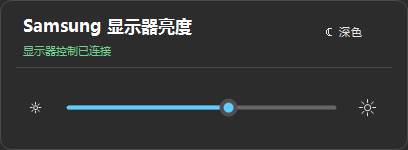

# Samsung Tizen Brightness

<p align="center"><a href="README.md">English</a> · <strong>简体中文</strong> · <a href="README.ko.md">한국어</a> · <a href="README.es.md">Español</a></p>

通过 **IP Remote 直接调节硬件背光**的 Windows 托盘程序。不需要电视端应用、开发者模式、Tizen Studio 或开发证书。

<p align="center"></p>

## 设置

1. 在[最新成功构建](https://github.com/dttutty/samsung-tizen-brightness/actions/workflows/build.yml)的 **Artifacts** 中下载 **Samsung-Tizen-Brightness-win-x64**，需要登录 GitHub。
2. 电脑与显示器连接同一局域网。在电视上进入 **设置 → 全部设置 → 连接（Connection）→ 网络 → 专家设置（Expert Settings）→ IP Remote**，选择 **Enable（启用）**。
3. 启动程序并填写显示器 IP。右键托盘图标 → **授权 IP Remote…**，在电视上选择一次 **Allow（允许）**。配对时请保持电视开机。
4. 左键托盘图标即可调亮度。右键菜单 → **语言**，可切换界面语言。

旧机型可能使用 **设置 → 常规（General）→ 网络 → 专家设置**。如果 IP Remote 不可用，检查同一菜单中的 **Power On with Mobile**；开启这项电视设置不会让本程序自动开关机。参见 [Samsung 设置指南](https://image-us.samsung.com/SamsungUS/samsungbusiness/tv-ci-resources/Samsung-IP-Control.pdf)。

## 条件与行为

- Windows 11、.NET 10 Desktop Runtime、兼容的 Samsung 显示器。已验证 M7 / M70B（`LS43BM702UNXZA`），其他型号需实测。
- 只调亮度：不自动开关机、不发送 Wake-on-LAN、不显示倒计时，也不使用画面菜单兼容模式。显示器自身的无信号待机不受影响。
- 可选随 Windows 登录启动，只启动托盘程序。保留 Windows 深浅色模式切换。
- 授权通过 Windows DPAPI 加密并绑定电视证书，仅保存在本机；普通点击不会申请权限。

## 构建

```powershell
dotnet publish .\src\SamsungTizenBrightness\SamsungTizenBrightness.csproj -c Release -r win-x64 --self-contained false
dotnet run --project .\tests\SamsungTizenBrightness.Tests -c Release
```

非官方社区项目，与 Samsung 无关。不包含恢复出厂或 Service Menu 操作。

[MIT](LICENSE)
